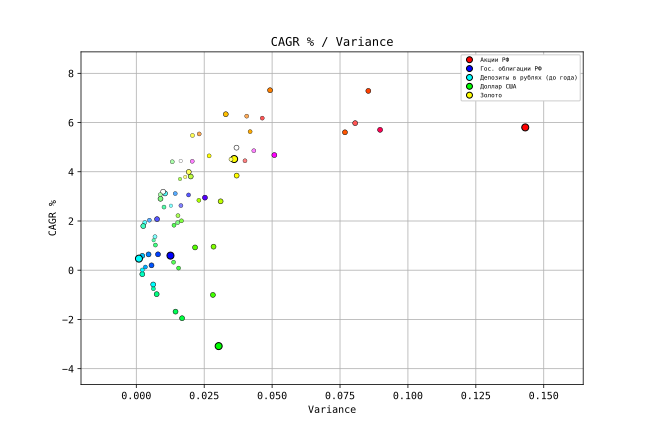
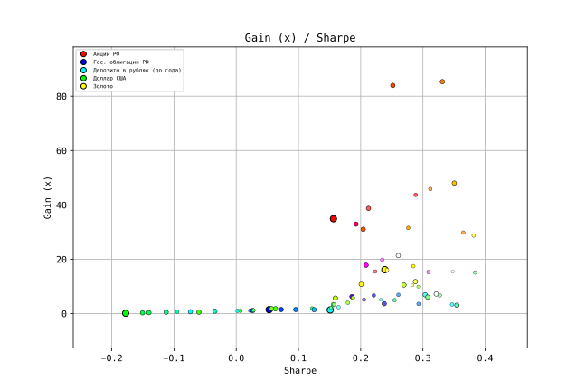

### Investment portfolio optimizer

This simple script will simulate rebalancing portfolios with given set of assets and display statistics.

### How to use

- Install requirements via `python3 -m pip install -r requirements.txt`

- Save market data into [asset_returns.csv](asset_returns.csv) file. Each row is one rebalancing period, each column is revenue from corresponding asset. Look at example file for details.
- Open [asset_colors.py](asset_colors.py) and edit asset colors to your taste.
- Run `optimizer.py` with `--precision=10` and take a look at standard output. Precision is specified in percent.

Results of edge case portfolios will be displayed in terminal.

Check SVG graphs in `result` folder for all portfolios performances.

Note that ALL portfolios will be drawn on SVG. Your browser might not be able to display it.

Limit number of assets and set precision higher to avoid this.

### What does it actually do?

Script will generate all possible investment portfolios with every asset allocated from 0 to 100% stepping according to `--precision` parameter.

Then every portfolio is simulated through market history, rebalancing at every step. Rebalancing assumes selling all assets with new prices and buying them back according to portfolio's asset allocation. For example:

| Asset1  | Asset2  | Asset1 (20%)           | Asset2 (80%)           | Portfolio value            |
| ------- | ------- | ---------------------- | ---------------------- | -------------------------- |
| (start) | (start) | 0.2                    | 0.8                    | 1                          |
| -10%    |  25%    | 0.2 - 10% = 0.18       | 0.8 + 25% = 1          | 0.18 + 1 = 1.18            |
|         |         | 1.18 * 20% = 0.236     | 1.18 * 80% = 0.944     | 1.18 = 0.236 + 0.944       |
|  15%    |  -5%    | 0.236 + 15% = 0.2714   | 0.944 - 5% = 0.8968    | 0.2714 + 0.8968 = 1.1682   |
|         |         | 1.1682 * 20% = 0.23364 | 1.1682 * 80% = 0.93456 | 1.1682 = 0.23364 + 0.93456 |

### Demo SVGs
(You need to download them to enable interactivity)

